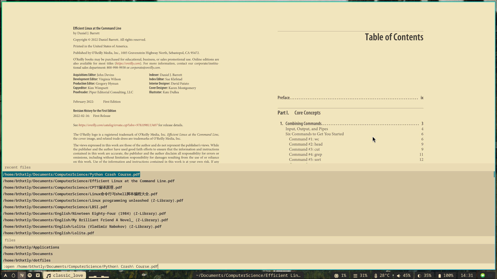
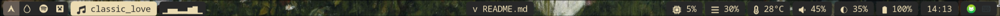

<!---
vim:nospell:nowrap
--->
# These are my dotfiles
They are precious and fantastic!

## [Hyprland](https://hyprland.org)
Hyprland is a tiling window manager on Wayland.
```sh
hypr
├── configs
│   ├── appearence.conf
│   ├── autostart.conf
│   ├── input.conf
│   ├── keybinds.conf
│   ├── plugins.conf
│   ├── variables.conf
│   └── windowrule.conf
├── hypridle.conf         # deal with suspend
├── hyprland.conf         # refer to ``configs/''
├── hyprlock.conf         # lock screen
├── hyprpaper.conf        # wallpapers
├── pyprland.toml         # scratch pads
└── scripts
    ├── BrightnessKbd.sh  # use keyboard to modify brightness and send notifications
    ├── icons/
    ├── switcher.sh       # switcher between light and dark mode for kitty, nvim, rofi and zathura
    ├── Volume.sh         # use keyboard to modify volume and send notifications
    └── xdg-d-p-hypr.sh   # I forget its function
```

## [neovim](https://github.com/neovim/neovim)
Base on [LazyVim](https://lazyvim.org), a neovim distribution.
```sh
nvim
├── current_theme.vim     # works with hypr/.config/hypr/scripts/switcher.sh, in .gitignore
├── init.lua
├── lazy-lock.json
├── lazyvim.json
├── lua
│   ├── config
│   │   ├── autocmds.lua
│   │   ├── keymaps.lua
│   │   ├── lazy.lua
│   │   └── options.lua
│   └── plugins
│       ├── ai.lua          # use ollama with neovim
│       ├── blink.lua       # auto completion and custom snippets
│       ├── colorscheme.lua # gruvbox, strawberry(pink) and everforest colorscheme
│       ├── disable.lua     # don't get used to bufferline, flash and noice
│       ├── easy_align.lua  # align is important
│       ├── fzf.lua         # very excellent fuzzy finder
│       ├── highlight.lua   # add highlight supports for some file types
│       ├── kitty_scrollback.lua  # operate kitty like in nvim buffer
│       ├── lualine.lua     # remove "branch" and change separator
│       ├── mini.lua        # more text objects
│       ├── neovide.lua     # neovim GUI
│       ├── oil.lua         # file manager in nvim buffer
│       ├── origami.lua     # <left> and <right> to unfold and fold
│       ├── outline.lua     # symbol tree
│       ├── small.lua       # surround, rainbow brackets, repeat, zoxide, undotree, maximize and sideways
│       ├── snacks.lua      # dashboard
│       ├── toggleterm.lua  # not configured
│       ├── vimtex.lua      # not configured
│       └── vimwiki.lua     # vimwiki, markview and markdown-preview, for taking notes
├── .neoconf.json
├── pack/
├── snippets/
└── stylua.toml
```

## [kitty](https://sw.kovidgoyal.net/kitty)
 Kitty is a powerful and [highly customizable](https://sw.kovidgoyal.net/kitty/conf)
 terminal emulator.
```sh
kitty
├── current_theme.conf    # works with hypr/.config/hypr/scripts/switcher.sh, in .gitignore
├── gruvbox_dark.conf     # theme
├── gruvbox_light.conf    # theme
├── kitty_all.conf        # all options
└── kitty.conf            # font, kitty_scrollback and keybinds to work like tmux
```

## zsh([ohmyzsh](https://github.com/ohmyzsh/ohmyzsh) as the framework)
**Z** **SH**ell is a powerful shell. Oh My Zsh is a framework for managing zsh
configuration.
```sh
zsh
├── .oh-my-zsh
│   └── custom
│       ├── aliases.zsh
│       ├── example.zsh
│       ├── plugins/
│       ├── themes/
│       ├── timer.zsh
│       ├── variables.zsh
│       └── zoxide.zsh
├── .p10k.zsh
├── .zprofile
├── .zshenv
└── .zshrc

(most unimportant files are ignored)
```

## [vifm](https://github.com/vifm/vifm)
Vifm is a **VI**m-like **F**ile **M**anager in terminal.
```sh
vifm
├── colors/               # gruvbox theme
├── favicons.vifm
├── scripts/              # nothing here though
├── vifm-help.txt
└── vifmrc                # I think only this matters, or not even this...
```

## [kmonad](https://github.com/kmonad/kmonad)
Kmonad is "an advanced keyboard manager", which enable you to change keyboard
layout and add layers for __any__ keyboards.
```sh
kmonad
├── colemak-dh-seniply-split.kbd  # an example of custom keyboard(https://stevep99.github.io/seniply/)
├── config.kbd                    # my config file, use colemak layout and many many layers
├── Keycode.hs                    # keynames
└── tutorial.kbd                  # official tutorial from its github repo
```

## [fusuma](https://github.com/iberianpig/fusuma)
Fusuma enables more gestures for touchpad.
```sh
fusuma
└── config.yml
```

## [rofi](https://github.com/davatorium/rofi)
Rofi is a dmenu replacement as an application launcher and window switcher
```sh
rofi/.config/rofi/
├── config.rasi
├── current_theme.rasi    # works with hypr/.config/hypr/scripts/switcher.sh, in .gitignore
└── gruvbox-rofi/
```

## [zathura](https://github.com/pwmt/zathura)
Zathura is a simple Document viewer that supports vim-like keybinds.

```sh
zathura
├── current_theme.conf    # works with hypr/.config/hypr/scripts/switcher.sh, in .gitignore
├── zathura-gruvbox/
└── zathurarc             # keybinds, scroll method and colorscheme
```

## [waybar](https://github.com/Alexays/Waybar)
Waybar is a highly customizable Wayland bar.

```sh
waybar
├── config.jsonc
└── style.css
```

## [vlc](https://www.videolan.org/vlc/)
VLC is a media player
```sh
vlc
├── vlc-qt-interface.conf
└── vlcrc
```

## [vimium](https://github.com/philc/vimium)
Vimium is an browser extension available on Chrome and Firefox, enables you to
operate webpages in the vim way.
```sh
vimium/
├── keymap.txt
├── search_engines.txt
├── vimium-options.json   # the export file
└── vimiumUI.css
```
